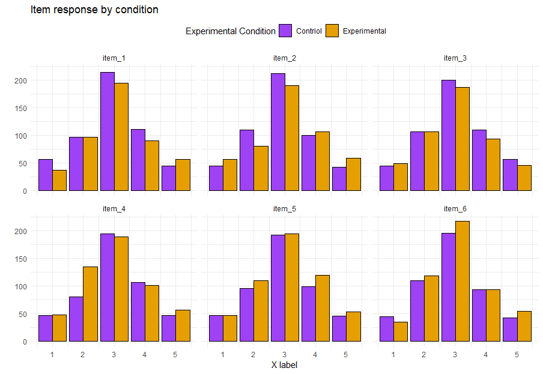
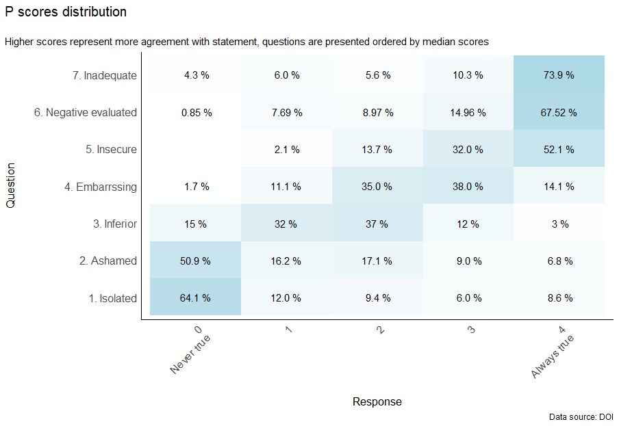

# A book for plots in R

Mainly for psychology papers. And focusing on creative and concise solutions for ordinal responses (common in psychology research)

## Items (1-5 response) by condition

Here we have a plot of items for two experimental conditions in which we want to compare the distributions. We order the plots by it median

## Ordinal responses as heatmap

